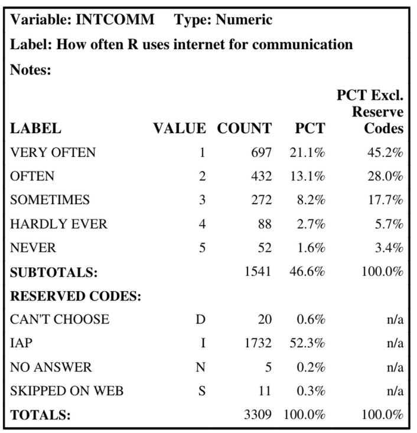

## Introduction  {.smaller}

- The General Social Survey (GSS) administered by the National Opinion Research Council at the University of Chicago (NORC) is one of the largest large-scale nationally representative surveys that has been conducted since 1972

- The GSS includes a number of survey questions relating to demographics, attitudes, and behaviors on a variety of sociological topics.

- The most recent edition of the GSS was conducted in 2024 and included a special module on digital technology usage (called the "Digital Societies" module)

## Introduction {.smaller}

- "Social Capital" and "Digital Capital" are two concepts used by social scientists to describe engagement with social systems and digital technologies

- Prior research has investigated the relation between social capital, digital capital, and socio-economic status

- Our research goal is to do exploratory data analysis to find the association between different GSS questions relating to attitudes and behaviors regarding social interaction and usage of digital technology to attempt to identify the latent structure of social and digital capital and to see if there is evidence of relation between these two factors or other socio-economic variables.


## Methods - Overview

- Dimensionality reduction is commonly used as a technique for exploratory data analysis in large multivariate datasets

- The most common technique is Principal Component Analysis (PCA) which finds linear combinations of the features so that each successive component maximizes the overall variance. Thus only a small numer of components can be retained while maximizing the amount of variance accoutned for

- PCA also allows for visual analysis to identify features which are associated with each other

## Methods - Limitations of PCA

- However, PCA is designed for usage of continuous numerical data

- Surevy data is either categorical or ordinal (Likert Scale)

- Various methods have been designed for dimensionality reduction of survey data, including just treating ordinal data as continuous numerical data and techniques for non-linearly scaling the ordinal data

- Alternatively, MCA has been designed for analysis of categorical data (and ordinal data can be transformed to be categorical)

## Methods - MCA

- Multiple Correspondence Analysis (MCA) is an extension of Correspondence Analysis

- CA is a technique for analyzing correspondence of two variables

- MCA extends CA by conducting CA on a table where the rows are the total number of observations and the columns are expanded observation levels of the features


## Data Exploration and Visualization

- GSS consists of categorical questions and likert-scale questions

- Likert-scale questions measure a respondent's attitude in a number of ordinal steps e.g. from "strongly disagree" to "strongly agree"

- We are considering 24 Likert-scale variables relating to sociality and digital technology usage

- In addition, we are considering 11 supplemental variables (a mix of categorical, ordinal, and numerical) which will not be active in the MCA calculation, but will be plotted on the MCA graph.

## Data Exploration and Visualization {.smaller}
An example of the GSS code book for a question:




## Data Exploration and Visualization {.smaller}

### Active Variables

```{r, message=FALSE}
library('FactoMineR')
library('Factoshiny')
library('factoextra')
library('tidyverse')
library('haven')
library('here')
library('knitr')
library('kableExtra')

data <- read.csv('data.csv') %>% select(!X)


```

```{r, warning=FALSE, echo=F}
suppVarNames = suppVarNames = c("EDUC","CLASS","RACECEN1.mod","WRKSTAT","MARITAL","AGE","CHILDS","SEX","RELTRAD","ATTEND","RELPERSN", "RELACTIV")
active.long <- data |> pivot_longer(!all_of(suppVarNames), names_to = "variable", values_to = "value")


ggplot(active.long, aes(x=value, color=variable,fill=variable)) +
  facet_wrap(~variable, scales='free', ncol=6) +
  geom_bar() +
  theme(legend.position = "none")
  

```

## Data Exploration and Visualization 

### Supplementary Variables {.smaller}
```{r, warning=FALSE, echo=F}
supplementary.long <- data |> pivot_longer(all_of(suppVarNames),names_to = "variable", values_to = "value")

ggplot(supplementary.long, aes(x=value, color=variable,fill=variable)) +
  facet_wrap(~variable, scales='free', ncol=4) +
  geom_bar() +
  theme(legend.position = "none")
```

## Modeling and Results

-   Data was downloaded from the NORC website in SAS file format

- Due to the large size of the dataset, a smaller subset was taken containing only the variables of interest and all observations with NA values were dropped, then this was exported to a CSV for ease of use

- All likert-scale variables were converted to boolean (1 if the response was above the median response for that variable) for ease of analysis in MCA


```{R, message=FALSE}
#data columns to exclude from MCA
MCAexclude = suppVarNames

likert2Boolean <- function(x){
  (x>median(data[[cur_column()]])) |>         #this will be a boolean that will be true if x is greater than the median of the column
    as.integer() |> as.factor()               #then turning boolean into an integer for ease of reading graph and then into a factor
}

#creating dataframe that ONLY has supplementary variables
suppVars = data |> select(all_of(suppVarNames)) |>
  mutate(across(all_of(c("ATTEND", "RELPERSN", "RELACTIV")),likert2Boolean)) |>
  mutate(across(!all_of(c("EDUC","AGE","CHILDS")),factor))  # here I'm making all the columns EXCEPT for EDUC, AGE, and CHILDS into factors because these three are numeric


MCAdata <- data |>
  select(!all_of(MCAexclude)) |>                        # selecting variables not in the excluded set
  mutate(across(everything(),likert2Boolean))      # applying my likert to boolean function

#Create dataframe with both MCA vars and supp vars
MCAdataWithSups <- cbind(MCAdata,suppVars) 

#Creare a vector with the indices of all supplementary variables
suppIndices = length(MCAdata)+1:length(MCAdataWithSups)

#Create a vector with the indices of all quantitative variables (which should also be supplementary)
supQuantInd <-  which(sapply(MCAdataWithSups,class) != 'factor')

#create a vector of all qualitative variables
QualInd <-  which(sapply(MCAdataWithSups,class) == 'factor')
#create a vector of all SUPPLEMENTARY qualitative variables
supQualInd <- QualInd[QualInd %in% suppIndices]

res.mca <- MCA(MCAdata,graph=FALSE)
res.mca.withsupps <- MCA(MCAdataWithSups,graph=FALSE,quanti.sup = supQuantInd,quali.sup = supQualInd)
```


## Modeling and Results

### Scree Plot {.smaller}
::::: {style="font-size: 70%;"}

:::: {.columns}

::: {.column width="60%"}
```{r, warning=FALSE, echo=F}
#| fig-width: 10
#| fig-height: 8
res.mca <- MCA(MCAdata,graph=FALSE)
res.mca.withsupps <- MCA(MCAdataWithSups,graph=FALSE,quanti.sup = supQuantInd,quali.sup = supQualInd)
fviz_eig(res.mca)
```
:::

::: {.column width="40%"} 


- We can see that there is one dominant component that accounts for the majority of the variance

- Note that eigenvalues tend to be smaller in MCA compared to PCA

:::

::::

:::::

## Modeling and Results

### Categories Plot
::::: {style="font-size: 60%;"}

:::: {.columns}

::: {.column width="60%"}
```{r, warning=FALSE, echo=F}
#| fig-width: 10
#| fig-height: 8
fviz_mca_var(res.mca, repel=T)
```
:::

::: {.column width="40%"}

- Axis one captures "Digital Capital"

- Axis two captures "Social Capital"

- Note that the variables with "_1" correspond to a higher than median response and therefore a higher amount of *disagreement* with the question

- Therefore, areas to the right indicate **lower** digital capital and to the top **lower** social capital

:::

::::

:::::

## Modeling and Results

### Variables Plot

::::: {style="font-size: 60%;"}

:::: {.columns}

::: {.column width="60%"}
```{r, warning=FALSE, echo=F}
#| fig-width: 10
#| fig-height: 8
fviz_mca_var(res.mca, repel=T, choice='var')
```
:::

::: {.column width="40%"}

- This plot captures the correlation of each variable with each component (but not direction)

- Some variables are associated heavily with digital capital (INTSURF and INTSKILL)

- Some variables are associated heavily with social capital, notably including some variables like INTRUST, INTGAME, and INTMEET, which capture the usage of digital technologies for social purposes

:::

::::

:::::

## Modeling and Results

### Variables Plot (with supplementary variables)

::::: {style="font-size: 60%;"}

:::: {.columns}

::: {.column width="60%"}
```{r, warning=FALSE, echo=F}
#| fig-width: 10
#| fig-height: 8
fviz_mca_var(res.mca.withsupps, repel=T, choice='var')
```
:::

::: {.column width="40%"}

- Most of the supplementary variables are located towards the center of the graph, indicating low association with the two components

- AGE and WRKSTAT (work status) stand out as having a higher correlation
:::

::::

:::::


## Modeling and Results

### Quantitative Supplementary Variables

::::: {style="font-size: 60%;"}

:::: {.columns}

::: {.column width="60%"}
```{r, warning=FALSE, echo=F}
#| fig-width: 10
#| fig-height: 8
fviz_mca_var(res.mca.withsupps, repel=T, choice='quanti.sup')
```
:::

::: {.column width="40%"}

- Age is strongly associated with both social capital and digital capital

- An increase in age is associated with **lower** social capital and **lower** digital capital

- Years of education and number of children show weaker effects

- Having more children associated with **lower** social capital and **lower** digital capital

- Having more years of education associated with **higher** social capital and **higher** digital capital

:::

::::

:::::

## Modeling and Results

### Qualitative Supplementary Variables

::::: {style="font-size: 40%;"}

:::: {.columns}

::: {.column width="60%"}
```{r, warning=FALSE, echo=F}
#| fig-width: 10
#| fig-height: 8
fviz_mca_var(res.mca.withsupps, repel=T, invisible='var')
```
:::

::: {.column width="40%"}

- Note the general direction of the points oriented from the bottom-left to the top-right. This indicates most supplementary variables are associated with both social and digital capital

- The categories with the strongest association are WRKSTAT_5 and WRKSTAT_6, corresponding with "retired" and "student" respectively. These two categories will be highly associated with age and therefore show similar affects to the age variable

- MARITAL_2 is "Widowed" and MARITAL_3 is "Divorced", again indicating a high relationship with age

- RELTRAD_3 is "Black Protestant" and RELTRAD_5 is "Jewish", both of these are associated with the social axis but not the digital axis

- CLASS_4 is "Upper Class", associated with higher social capital and higher digital capital

- Of the race categories, Asian-Americans are associated with both higher social and digital capital, "Other race" is associated with lower social capital and slightly lower digital capital, and hispanics are associated with lower social capital but higher digital capital.
:::

::::

:::::


## Conclusion

-   MCA Analysis found components associated with "Digital Capital" and "Social Capital"

-   Some variables associated with the social uses of digital technology were found to be more associated with social capital rather than digital capital

-   Many supplementary variables were not strongly associated with either social or digital component, however stronger associations were found among Age, employment status, and race

## References
::::: {style="font-size: 60%;"}

::: {#refs}
:::

::::